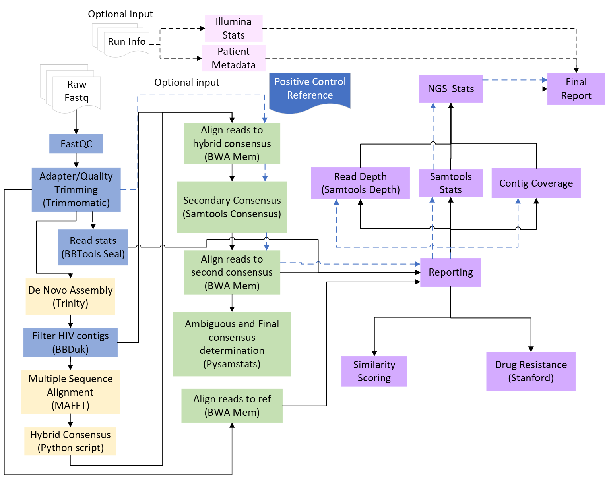

# HIVGenoPipe

[](https://www.nextflow.io/)
[](https://docs.conda.io/en/latest/)
[](https://www.docker.com/)
[](https://sylabs.io/docs/)


# HIVGenoPipe Quick Start 
## Sample data set
The MiSeq data used for testing this pipeline are available under SRA BioProject accesstion [PRJNA1218827](https://www.ncbi.nlm.nih.gov/bioproject/?term=PRJNA1218827)

## Create samplesheet
Use python fastq_dir_to_samplesheet.py on a fastq directory to create a samplesheet

Example:
```python
python fastq_dir_to_samplesheet.py test_data/filtered_reads/ test_sample_sheet.csv -sn -sd _ -si 2
```

Samplesheets should follow this csv format:
```
sample,fastq1,fastq1,sample_type
```
Sample types may be test, positive, or negative. Users may identify sample types within the directory using the `--positive_control_identifier <string>` or `--negative_control_identifier <string>` flags. Samples labeled as the positive/negative controls will generate separate statistics for reporting. Samples marked as positive controls may optionally be analyzed against a control reference (i.e. NL4.3)

##  Run nextflow
> [!NOTE]
> If you are new to Nextflow and nf-core, please refer to [this page](https://nf-co.re/docs/usage/installation) on how to set-up Nextflow. Make sure to [test your setup](https://nf-co.re/docs/usage/introduction#how-to-run-a-pipeline) with `-profile test` before running the workflow on actual data.

Example run statement:
```bash
nextflow run /your/pipeline/dir/HIVGenoPipe/main.nf \
--input samplesheet.csv \
-profile <docker/singularity/conda> \
--outdir <OUTDIR> \
--fasta ref.fasta
```

Additional run options include:
```
--metadata - <.csv> file that includes info for samples and can merge by the sample_id column
--rundir - path to Illumina run directory, will generate run level statistics in final report
--positive_control_ref – performs additional alignment of pos control samples to this second reference (i.e. NL4.3)
```

## Introduction

HIVGenopipe is a HIV drug resistance genotyping pipeline which deploys several well-known bioinformatics tools in combination with custom scripts to analyze NGS data (fastq) and return consensus sequences and relevant statistics. De novo assembly (Trinity) is used to create a preliminary contigs from cleaned FASTQ read data.  A hybrid consensus is created by filling in any gaps between contigs using a reference sequence of the user's choosing. The cleaned reads are aligned to the hybrid consensus to form a secondary consensus. The reads are aligned again to the secondary consensus. This two alignment method better allows for the retention of minor mutations that may inform drug resistance calls. The second alignment is used to determine consensus calls at different ambiguity sensitivities (5% and 15%, and a majority consensus by default). These consensus sequences are then queried in the Stanford HIV drug resistance database for relevant mutations. Comprehensive reports and statistics are available as outputs.

The pipeline is built using [Nextflow](https://www.nextflow.io), a workflow tool to run tasks across multiple compute infrastructures in a very portable manner. It uses Docker/Singularity containers making installation trivial and results highly reproducible. The [Nextflow DSL2](https://www.nextflow.io/docs/latest/dsl2.html) implementation of this pipeline uses one container per process which makes it much easier to maintain and update software dependencies. Where possible, these processes have been submitted to and installed from [nf-core/modules](https://github.com/nf-core/modules) in order to make them available to all nf-core pipelines, and to everyone within the Nextflow community!

<p align="center">
    
</p>

## Pipeline summary

1. Input check and quality control (`FastQC`, `Trimmomatic`)
2. De Novo assembly (`Trinity`)
3. Clean non-HIV contigs (`BBDuk`)
4. Align contigs with reference and create hybrid consensus (`MAFFT`, custom script `consensusFromMAFFT.py`)
5. Align reads to hybrid consensus (`bwa`)
6. Create secondary consensus (`samtools consensus`)
7. Align reads to secondary consensus (`bwa`)
8. Create final consensus sequences (`pysamstats`, custom script `pysamstats_parse.py`)
9. Submit consensus to HIV drug resistance db (custom scripts `stanford_json.py`, `stanford_summary.py`)
10. Gather summary statistics and reports

## Pipeline output
```
outdir
├── bbmap
├── final_consensus - all ambiguous/majority fastas
├── drug_resistance
│   ├── stanford_json
│   └── stanford_report - drug resistance, mutation, and protein seq reports
├── fastqc
├── filter_reads - HIV filtering
├── hybrid_align_bwa - first alignment
├── mafft
├── misc_reports
│   ├── check_coverage
│   ├── ngs_stats
│   └── samtools_stats
├── multiqc
├── pipeline_info - nextflow run reporting
├── pysamstats_reports - in/del reports, read stats files
│   ├── indel_report
│   └── read_stats_files
├── ref_align
│   ├── ref_align_bwa
│   └── ref_align_depth - read depth per position in alignment to ref
├── report
│   └── final_report.tsv - comprehensive report for all samples
├── sample_similarity_matrix - sample to sample alignment and matrix per % consensus
├── samtools_consensus
├── samtools_consensus_align
│   ├── sam_cons_align_bwa - final alignment to sample-specific intermediate consensus
│   └── sam_cons_align_depth - read depth per position in alignment to sample-specific intermediate consensus
├── trimmomatic - trimmed reads
└── trinity - de novo assembled contigs
```

## Customizing the workflow
### Positive control reference subworkflow:
This positive control subworkflow is enabled with the `--positive_control_ref <.fasta>` parameter. This subworkflow will align any positive control samples (as labeled in the samplesheet) to an additional control reference sequence, separate from the reference used for consensus determination. For example, `HXB2` is commonly used as a reference for consensus determination while `NL4-3` can be used as a positive control reference. This subworkflow was designed to help validate positive control samples as they are used alongside patient test samples.

Example of positive control reference subworkflow output:

| QC Metric | QC Status | Value | QC Range |
| --------- | --------- | ----- | -------- |
| Total HIV Read1 |	PASSED | 106724 | >=5000 |
| Total HIV Read1(% of raw) | PASSED | 85.699373 | 50-100 |
| Median Depth (reads) | PASSED	| 12906	| 200-100000000 |
| Depth MAD (reads) | PASSED | 2928.737| 200-100000000 |
| Contig Coverage (%) | PASSED | 100% | 100% |
| Error Rate (Read Variation %)	| PASSED | 0.002454332 | <1% |
| Contig Error Rate at 5% (%) | PASSED | 0 | <0.1% | 
| Contig Error Rate at 15% (%) | PASSED | 0 | <0.1% |


### Module settings can be adjusted here:
```
/conf/modules.config/
```
For example, you can set the consensus calling script in the following sections:
```groovy
withName: PYSAMSTATS {
        ext.args = '--min-baseq=15'
    }

withName: PYSAMSTATS_PARSER {
        ext.args = '-a 5 15 -d 200 -i -t -c'
    }
```
- pysamstats `--min-baseq` can be tuned to be more or less strict
- pysamstats parser script setting `-a` or `--ambiguity` controls the threshold for ambiguous base calls

Please see help messages for individual scripts or documentation of other pipeline tools for additional settings.

### Computational resource settings can be directly adjusted here:
```
nextflow.config
```
Or as params in the run statement ( e.g. `--max_memory 64.GB`) 
```
    // Max resource options
    // Defaults only, expecting to be overwritten
    max_memory                 = '128.GB'
    max_cpus                   = 16
    max_time                   = '240.h'
```
## Credits

We thank the following people for their extensive assistance in the development of this pipeline:

- LHRI Bioinformatics
- VISL 
- Nf-core community 


## Citations

<!-- TODO nf-core: Add citation for pipeline after first release. Uncomment lines below and update Zenodo doi and badge at the top of this file. -->
<!-- If you use HIVGenoPipe for your analysis, please cite it using the following doi: [10.5281/zenodo.XXXXXX](https://doi.org/10.5281/zenodo.XXXXXX) -->

<!-- TODO nf-core: Add bibliography of tools and data used in your pipeline -->

An extensive list of references for the tools used by the pipeline can be found in the [`CITATIONS.md`](CITATIONS.md) file.

You can cite the `nf-core` publication as follows:

> **The nf-core framework for community-curated bioinformatics pipelines.**
>
> Philip Ewels, Alexander Peltzer, Sven Fillinger, Harshil Patel, Johannes Alneberg, Andreas Wilm, Maxime Ulysse Garcia, Paolo Di Tommaso & Sven Nahnsen.
>
> _Nat Biotechnol._ 2020 Feb 13. doi: [10.1038/s41587-020-0439-x](https://dx.doi.org/10.1038/s41587-020-0439-x).
